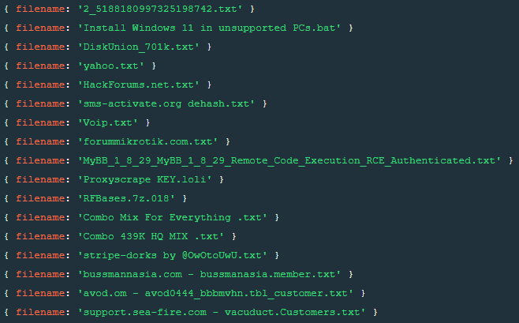

# 💽 Telegram Scraper Dump 

Index Message from your telegram account and find juicy content in it.

> **My usecase**
> 
> I'm in several leak channels and I needed to be able to quickly search for interesting files and download them

## ❓ How to use

### 🔧 Setup 

1. Clone this repo
2. Install dependencies with `poetry install`
3. Run `poetry run python indexer.py` for init config.yaml file and follow the instructions

### 🗃️ Indexing

1. Run `poetry run python indexer.py` again to index your dialogs
2. Go to on your mongodb on collection `channels` and enable the channels you want to index
3. Run `poetry run python indexer.py` again to index the selected channels (first run take a while depending on the number of messages and dialogs you have enabled)

> **Note**
> 
> You can rerun the indexer at any time to update the index with new messages

### 🔍 Searching

1. Go on your mongodb on collection `messages` and find type of content you want to download
2. Write a query to find this content and add it in the `mongodb_download_filter` field of the config.yaml file as yaml (see example on the config.yaml file)
3. Run `poetry run python downloader.py` to download the content

> **Note**
> 
> You can rerun the downloader at any time to download only the new content
> 
> The telegram api is rate limited, so you download speed is limited by telegram

## Results

> Query `db.messages.find({type: 'messagemediadocument',mime_type: 'text/plain'}, {_id: 0, filename:1})`



## 🐳 MongoDB With docker

You can use the docker-compose file to run a mongodb instance with web interface

```bash
docker-compose up
```

- MongoDB port: `27017`
- MongoDB data directory: `./data`
- MongoExpress web port: `8081`

## 🔩 Tools

- [Poetry](https://python-poetry.org/) - Python dependency management
- [MongodbClient](https://www.mongodb.com/products/compass) - Mongodb GUI
